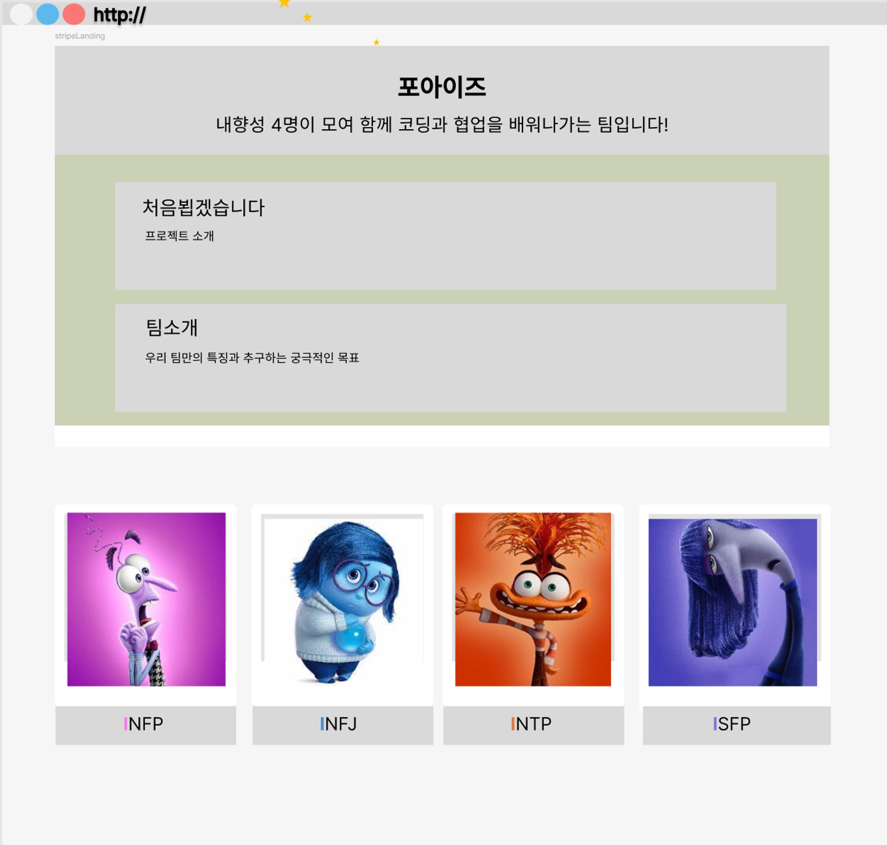
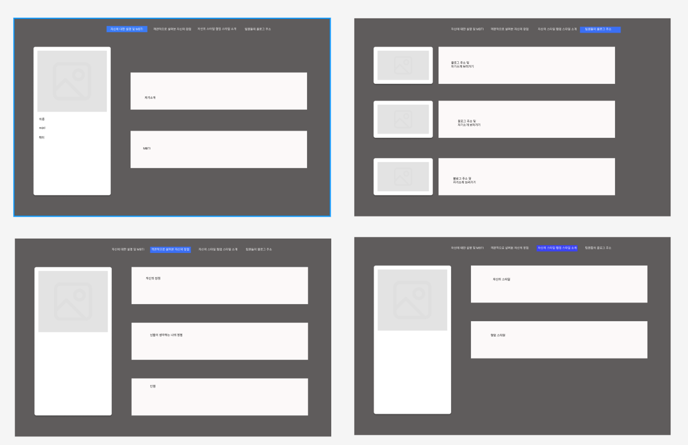

# [파이브아이즈 (24조)](https://gipyeung.github.io/4i_Mini_Project/index.html) 👈구현 페이지 바로가기
### [화면 시연 영상](youtubelink)

- 팀원 소개 

    | 이름 | 역할 | MBTI | 블로그 | 한마디 | TMI |
    | --- | --- | --- | --- | --- | --- |
    | 홍기평 | 팀장 | INFP | [🔗](https://github.com/gipyeung?tab=repositories) | 앞으로 열심히 하겠습니다 | 운동 좋아합니다 |
    | 이봄 | 팀원 | INFJ | [🔗](https://everyday-spring.com/) | 반갑습니다 | 제주도 입니다 |
    | 김태주 | 팀원 | INTP | [🔗](https://everyday-spring.com/) | 반가워요 앞으로 화이팅입니다 | 고양이 집사입니다 |
    | 이유진 | 팀원 | ISFP | [🔗](https://velog.io/@lee9040s/posts) | 같이 열심히 해보아요~! | 커피에 진심입니다 |
    | 위종혁 | 팀원 | INFJ | [🔗](https://jonghyeok-1.tistory.com/) | 잘부탁드립니다. | 운동 좋아합니다 |

- 팀
    - 팀명 : 파이브아이즈
    - 팀 소개 : 내향성 5명이 모여 함께 코딩과 협업을 배워나가는 팀입니다!
- 프로젝트
    - 프로젝트명 : 처음뵙겠습니다
    - 프로젝트 소개 : MBTI ‘I’들이 모여 숨겨져 있는 자신을 소개하는 용기내기 프로젝트
- 개발 일정(WBS)
    
    2024.07.15(월)10:00 ~ 2024.7.19(금) 11:00
    
    [개발 일정 (스프레드시트)](https://docs.google.com/spreadsheets/d/1uizkycFczUMB-Do1Bqs513TMB4bMPd_PTSxRwhujUjw/edit?usp=sharing)
    
- 역할 분담

    | 이름 | 와이어 프레임 | HTML/CSS | JavaScript |
    | --- | --- | --- | --- |
    | 홍기평 | 개인 페이지 틀 구성 | 개인 페이지 HTML | 1차  |
    | 이봄 | 개인 페이지 상세 구현 | 개인 페이지 CSS |  |
    | 김태주 | 메인 페이지 틀 구성 | 메인 페이지 HTML |  |
    | 이유진 | 메인 페이지 상세 구현 | 메인 페이지 CSS |  |
    | 위종혁 | 개인페이지 및 메인페이지 보조 | HTML / CSS 보조 |  |

- 사용하는 기술
    - HTML
    - JavaScript
    - CSS

- 와이어프레임
    - 메인 페이지
    
    
    
    - 개인 페이지
    
    
    
### 우리 팀 규칙

- 점심시간 13 : 00 ~ 14 : 00
- 저녁시간 18 : 30 ~ 19 : 30
- 자주 소통하고 적극적으로 의견을 냅니다
- 팀원 각자의 장점을 파악하고 적극적으로 도움을 요청합니다
- 어려운 문제는 다같이 의견을 나누어 가며 해결합니다
- 서로에게 동기부여가 될 수 있도록 긍정적인 언어를 사용합니다

### 팀별 일정표

- 24.07.15 : S.A. 작성 및 제출 (21:00)
- 24.07.16 : front-end 학습 및 코드 작성
- 24.07.17 : 코드 작성
- 24.07.18 : 프로젝트 최종 피드백 및 발표 자료 완성
- 24.07.19 : 검토 및 제출 (11:00)
